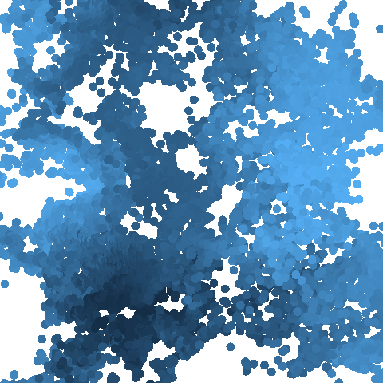
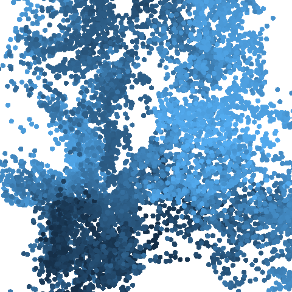

# Art-4-Fun

Repository for generative art in R!

## Introduction

Welcome to Art-4-Fun! This repository is dedicated to showcasing and exploring the world of generative art. Generative art is a fascinating field where artists use algorithms, code, and sometimes randomness to create unique and often mesmerizing pieces of art.

## About Generative Art

Generative art involves the use of computational processes to generate artwork. These processes can range from simple algorithms to complex machine learning models. The beauty of generative art lies in its ability to produce endless variations and surprises, often blurring the line between the artist and the artwork itself.

## Repository Content

In this repository, you'll find a collection of generative art pieces created by various artists. These artworks explore different techniques, styles, and concepts within the realm of generative art. Feel free to browse through the code, experiment with it, and perhaps even contribute your own creations!

## How to Contribute

If you're an artist or a programmer interested in generative art, we welcome your contributions! Whether it's sharing your own generative art pieces, contributing improvements to existing artworks, or simply engaging in discussions about the art form, your participation is valued.

To contribute, simply fork this repository, make your changes, and submit a pull request. Don't forget to include a brief description of your contribution and any relevant details.

## Get Started

Ready to dive into the world of generative art? Clone this repository to your local machine and explore the artwork and code samples provided. Feel free to experiment, modify, and create your own generative art pieces. Let your creativity flow and have fun!

## Contact

Have questions, suggestions, or feedback? Feel free to reach out to us via [email](sgonzalezve@unal.edu.co) in this repository. I`m always eager to hear from fellow generative art enthusiasts!

# Some tips in tidyverse from here

  
  
  
  

# To the results

  
  
  
  

# Some variants

  
  
  

